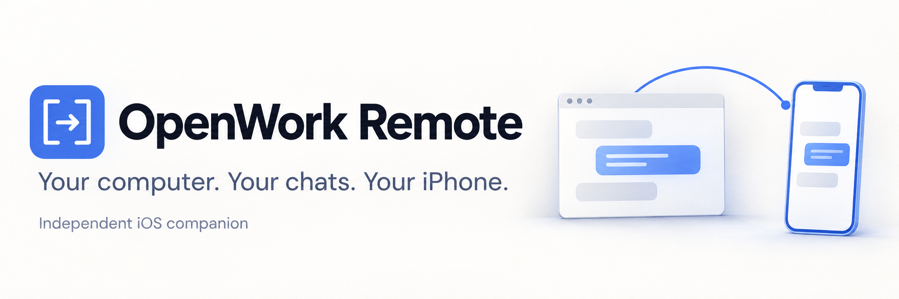

# OpenWork Remote

An independently maintained iOS companion for [OpenWork](https://github.com/different-ai/openwork). Pick up a chat from your iPhone while the work keeps running on your computer.

This is an early source release. Desktop source builds have been tested on macOS and Ubuntu Linux. Installation and re-pairing have been confirmed on a physical iPhone. Broader cellular and recovery qualification is still pending. It isn't an official OpenWork app. Beta builds are distributed through invitation-only internal TestFlight testing. There is no public TestFlight link or App Store release.

## What you can do

- Connect with a short-lived pairing code and approve the phone on your computer.
- Allow selected projects, or explicitly allow all current and future projects.
- Read chats, send messages, stop work, and review supported approval requests.
- Change a chat's model and supported reasoning settings.
- Long-press a recent chat to rename it on the phone and computer (requires a host advertising rename support).
- Review and revoke saved folder permissions where the host supports them.
- Keep tool calls in a compact Activity row and expand them when needed.

The host decides which actions are available. OpenWork v2 doesn't expose a general approval-mode switch through this integration. Unsupported permissions stay on the computer.

Internal TestFlight build **0.1.0 (5)** includes questions and selected photo/PDF
attachments. Physical picker, cellular and recovery acceptance remain open.
The current source candidate adds [generated-file previews and explicit sharing](docs/ARTIFACTS.md); those results features are not in build 5.
See [attachment behavior, data handling and qualification limits](docs/ATTACHMENTS.md).

## How it connects

The iPhone talks to a small, scoped bridge managed by OpenWork. The bridge uses the local OpenWork runtime. It doesn't give the phone a shell, a generic proxy, or the runtime's credentials.

Both devices need [Tailscale](https://tailscale.com/) on the same permitted private network. The bridge uses Tailscale Serve for HTTPS. Your computer must be awake with OpenWork running. There is no public tunnel, and the app keeps normal TLS certificate validation enabled.

The desktop work lives on the [`jorvek/seamless-remote-access` branch of our OpenWork fork](https://github.com/BitL8-ByteShort/openwork/tree/jorvek/seamless-remote-access). See its [setup and protocol guide](https://github.com/BitL8-ByteShort/openwork/blob/jorvek/seamless-remote-access/packages/remote-access/README.md) and [qualification record](https://github.com/BitL8-ByteShort/openwork/blob/jorvek/seamless-remote-access/packages/remote-access/docs/qualification.md). Integrated Remote access requires OpenCode v2 enabled for chats; installing the current official OpenWork release alone won't enable it. The desktop feature is off by default and also requires the deployment's feature policy to allow it.

## Install the beta

Invited testers can open Apple’s TestFlight invitation on their iPhone and install **OpenWork Remote**. TestFlight is the beta update route; a USB cable is not required. Updates use the existing app identity and retain its local pairing and drafts. If the computer revoked the phone, choose **Pair again** and approve a new connection in OpenWork.

TestFlight availability does not mean physical or cellular qualification is complete. The host still needs the integrated Remote access build described above.

## Build the app

You need a Mac with Xcode and Swift 6 support. The deployment target is iOS 18 or later. The core package also supports macOS 15 or later for tests. There are no external Swift package dependencies.

```sh
git clone https://github.com/BitL8-ByteShort/openwork-remote-ios.git
cd openwork-remote-ios
swift test
open OpenWorkRemote.xcodeproj
```

Select the **OpenWorkRemote** scheme and an iPhone Simulator, then run. To install on your own phone, select your development team in Signing & Capabilities and choose an available bundle identifier. No signing team, certificate, provisioning profile, or account credential is included here.

For an unsigned Simulator build:

```sh
xcodebuild -project OpenWorkRemote.xcodeproj \
  -scheme OpenWorkRemote -configuration Debug \
  -destination 'generic/platform=iOS Simulator' \
  -derivedDataPath build/DerivedData CODE_SIGNING_ALLOWED=NO build
```

The checked-in Xcode project is generated by `python3 scripts/generate-ios-project.py`. Run the generator after adding app source files. Keep personal signing settings out of commits.

## Pair a phone

Once a compatible host is available:

1. Enable OpenCode v2 for chats in Advanced settings. Open **Settings → Remote access** on the computer and enable phone access.
2. Choose **Pair a phone**. Scan its QR code in the iOS app, or paste the pairing code.
3. Review the request on the computer. Choose projects, then approve it.
4. Open a chat on the phone. You can change or revoke the phone's access from the computer.

If you revoke a phone, it shows **Pair again**. Create a new code on the computer, scan or paste it, and approve the new request. Drafts stay on the phone, scoped to their original computer and chat.

Approvals that the phone cannot safely handle ask you to continue on the computer. Losing a network connection doesn't automatically resubmit a message whose result is uncertain.

### Answer questions

On a host advertising question support, a pending question appears above the conversation, outside compact Activity. Choose answers or enter text, then tap **Send answers**. **Cancel** closes the sheet and keeps your draft. **Dismiss question** explicitly cancels the request on the computer. Unknown form types require the computer.

Question drafts and submission IDs are stored in a protected local file, scoped to the computer, project and chat. A changed request requires fresh review. An unconfirmed response is never sent again automatically; check the chat on the computer. Older hosts keep their existing chat functions without question replies.

## Privacy and security

Connection credentials are stored in the iOS Keychain. The app doesn't include analytics or crash-reporting services. Prompts still go to whichever model provider your OpenWork host uses, under that provider's terms.

See [SECURITY.md](SECURITY.md) for the security boundary and private vulnerability reporting. Please don't put pairing codes, tokens, transcripts, private hostnames, or signing files in issues.

## Contributing and licensing

Issues and pull requests are welcome. Write access is controlled by the repository owner; a public repository doesn't give visitors permission to push changes. See [CONTRIBUTING.md](CONTRIBUTING.md) for checks and review expectations.

The source and original artwork in this repository are [MIT licensed](LICENSE). See [NOTICE.md](NOTICE.md) for attribution and platform terms. OpenWork's maintainers aren't responsible for this iOS app.

The source candidate adds [read-only Workspace changes](docs/CHANGES.md). It includes outside-chat edits, requires host file access and provides no file-changing actions. This feature is not in TestFlight build 5.
