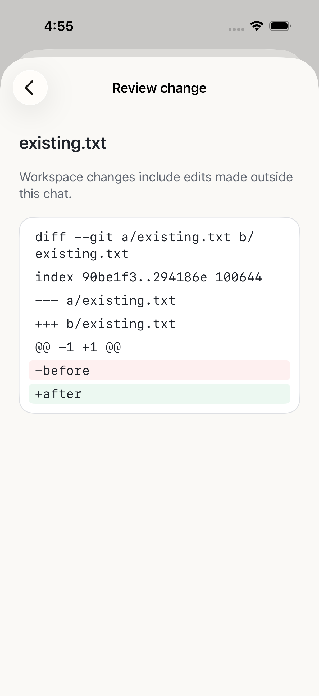

# Workspace changes — source candidate

Workspace change review is implemented in source. It is not included in internal
TestFlight 0.1.0 (5).

Open **Model & settings → This chat → Workspace changes**. Your computer must
support this capability and allow file transfer for this phone. A blocked entry
stays visible with a reason; the phone cannot expand its own permissions.

This is a read-only Git comparison against the workspace's current baseline.
It includes edits made outside the selected chat. Non-Git projects, repositories
without a baseline, binary files and omitted content direct you to OpenWork on
your computer. It is not a history of changes attributable only to this chat.

Select a file to read its diff. Additions and removals have text accessibility
labels as well as color. Text is selectable and passive; HTML, links and commands
in a diff are not executed. Long diffs use 200-line pages. Catalogs are bounded
to 100 files; each text response to 1 MiB/10,000 lines. Shortened lines or omitted
content are labelled. A changed revision requires refreshing the list.

There are no apply, revert, stage, commit or checkout controls. Done/back remain
local actions while requests finish. Switching chats, computers or leaving the
active context cancels reads and ignores old replies.

## Data flow and retention

The paired computer sends relative filename/status/count metadata and an
explicitly selected bounded text diff over normal HTTPS. Handles are opaque and
scoped to this phone, workspace, chat and revision. The phone supplies no host
path. Lists, diff bytes and display lines live in transient memory; closing the
context clears them. They are not persisted as a transcript or download cache.
Reviewing a diff does not itself send its contents to an AI provider.

This inventory informs the pending privacy/consent screens and final privacy
labels. It is not a published privacy policy.

## Qualification

Core/state regressions, four native synthetic flows and a stale-refresh recovery
test passed. Real paired HTTPS/native Simulator tests against actual Mac and
Ubuntu NUC workspaces passed. Host-local reads preserved disposable file bytes,
Git index/status and comparable existing chats/settings/pairing. Temporary test
connections and credentials were removed. Release Simulator compilation passed
and excludes the DEBUG fixture/live-configuration markers.

Existing synthetic sheets still report UIKit toolbar warnings. Physical phone,
iPad, cellular and full-candidate accessibility acceptance remain open; Simulator
evidence does not close those gates.

