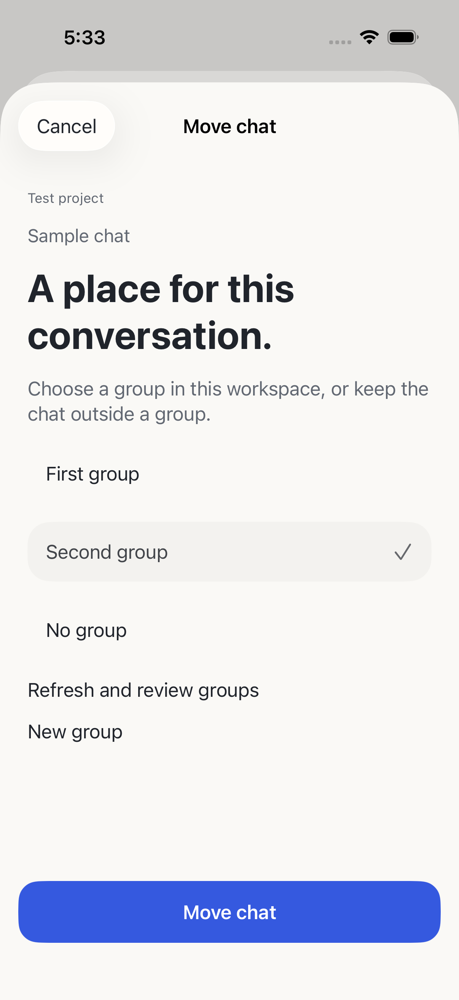
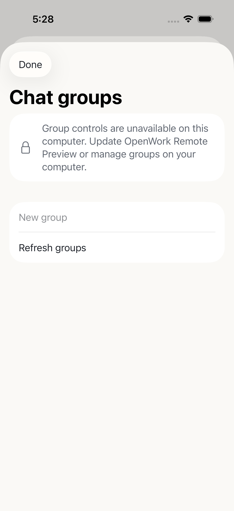

# Chat groups — source candidate

Open **Your chats** to view groups in the selected workspace. Search covers loaded
chat titles; choosing a visible group filter limits that list explicitly. Use
**New group** or **Manage groups** to create, rename, reorder or remove a group.
Long-press a chat, choose **Move to group**, select a group or **No group**, then
press **Move chat**. Selecting a row does not save. Cancel and Done are local.
Removing a group moves its chats to No group and keeps the chats.

Controls require a compatible, explicitly qualified computer and that project's
existing phone-access approval. They do not expand project permissions or require
file-transfer access. Older computers keep a visible locked entry with a handoff.
There are no prompts, model changes or chat deletion in group operations.

## Concurrent edits and recovery

The host checks the revision and uses only native granular commands, followed by
readback. An open phone form retains its workspace/connection and revision; a
newer desktop edit requires explicit refresh and review. Native OpenWork has no
atomic conditional revision API. Same-field changes in the narrow interval after
preflight follow native last-writer behavior; whole-group-state replacement is
never used. Unrelated assignments are preserved by native granular merging.

Each write has a durable device-bound UUID. Duplicate submissions replay the
same receipt, including group removal; a lost create response is not sent again.
If a response cannot be confirmed, the phone blocks further edits, refreshes the
current computer state and offers **Keep current groups** after review. This does
not claim that the uncertain phone action succeeded, and does not retry it.
Group lists are bounded to 100 groups and 10,000 assignments. Names are trimmed,
at most 100 Unicode scalars and 120 UTF-16 units to avoid native truncation.

## Data flow

The computer transfers group names, order, IDs, revision and chat assignments over
paired HTTPS into transient phone memory. Pending action metadata, target IDs and
any new group name are stored privately with file protection until confirmed or
explicitly reconciled. Host pairing/ledger storage retains mutation receipts and
request digests. Viewing or organizing groups does not send a prompt to the AI
provider. Final privacy declarations and device/reset acceptance remain separate.

This feature is not in internal TestFlight 0.1.0 (5). Physical iPhone/iPad,
cellular recovery and signed packaged host acceptance are still pending.

## Qualification and design mapping

Mac and actual Ubuntu NUC passed 193 bridge tests, typechecking and builds with
42 identical production-source hashes. Native paired HTTPS Simulator tests
performed phone rename/assignment, observed a native desktop rename with the
assignment preserved, then removed the disposable group without deleting its
chat. Both temporary pairings/HTTPS mappings were cleaned up; existing chats,
models, messages, defaults, permissions and pairing/ledger state were retained.
Core/state tests passed (50/63), including stale forms, lost replies and access
withdrawal; native synthetic create/rename/remove, explicit move/cancel and
unsupported/slow reads passed. Release Simulator compilation excludes DEBUG
controls. Existing synthetic UIKit toolbar warnings remain.

Canonical Penpot CG-01 maps to ChatListView / GroupEditor; CG-02 maps to
MoveChatView. Native sheets, explicit workspace context, visible blocked access,
local dismissal and accessible reorder actions follow DESIGN.md P3/P4/P9/P10/P11.

