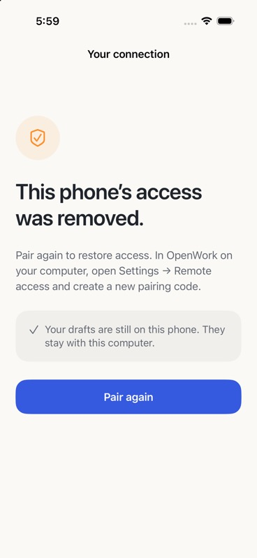

# Revoked pairing recovery

Build 3 distinguishes revoked access from a temporary connection failure. A rejected device credential stops reconnect attempts and displays the reviewed access-removed screen. Pair again clears the rejected local credential, cancels old connection work, and opens the normal scan/paste flow. The host must approve a fresh request.

Drafts and uncertain-send identifiers remain scoped to their original host and chat. Background/foreground transitions retain the revoked state. If Keychain removal fails, the app stays on recovery and explains how to retry. Ordinary network failures retain the existing pairing.

Validation on October 8, 2026: 20 core tests and four application-state regression tests pass, plus three iOS Simulator UI tests. State tests exercise the real app model with transport and persistence boundaries isolated. The native recovery screenshot and UI test use a Debug-only revoked-state fixture; they are not physical-device or live-host revocation evidence.

