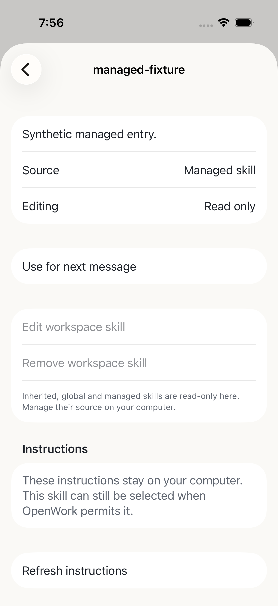

# Skills

Open **Skills** from the message's plus button or **Workspace settings**. Open a
row to inspect its source, select it for your next message, or edit a workspace
text skill. Selected skills appear as removable chips above the message field.
Selection belongs to that host, workspace and chat; it is cleared after a
confirmed send. Selecting a skill does not grant tool permissions.

The computer must advertise the appropriate capability and allow this project.
Editing also requires **Workspace administration** for this phone. Managed and
inherited entries remain read only. Managed instructions stay on the computer;
the phone can use their native catalog metadata without downloading those bodies.

The text editor preserves name/description frontmatter and keeps an unsent draft
on this phone. **Save workspace skill** is the deliberate computer write;
**Done** only saves the local draft and closes the editor. Removal requires an
explicit permanent-delete confirmation. Refresh never silently replaces your
draft with the computer's latest instructions.

Instructions are bounded to 64 KiB; the computer's 40 KiB encoded JSON request
limit also applies. A request that does not fit stays on the phone. Invalid or
stale edits keep the draft and require review. If a response is lost, the app
keeps one unconfirmed UUID and requires refresh/review instead of automatic retry.
Accepted readback must match the revision in the write receipt.

OpenWork's existing permission check runs for each selected-skill send. If the
computer needs approval, no prompt is sent and the phone retains the message and
selection with an instruction to continue on the computer. An existing native
allow rule remains usable. No approval mode or saved rule is changed by selection.

The source candidate has passed Mac/Ubuntu NUC paired HTTPS skill writes and
selection, Swift core/state tests and synthetic native UI checks. Physical-device
and full-candidate acceptance remain open. **TestFlight build 5 excludes skills.**

Both paired native Simulator flows edited, read back, selected and explicitly removed the disposable skill. The NUC flow also exercised scrolling its larger catalog. Source previews reopened with private backups and all existing comparable host state and phone grants preserved.

